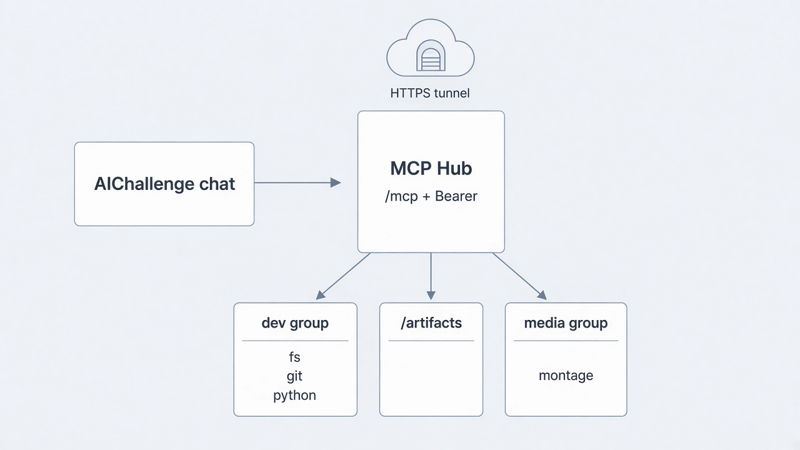
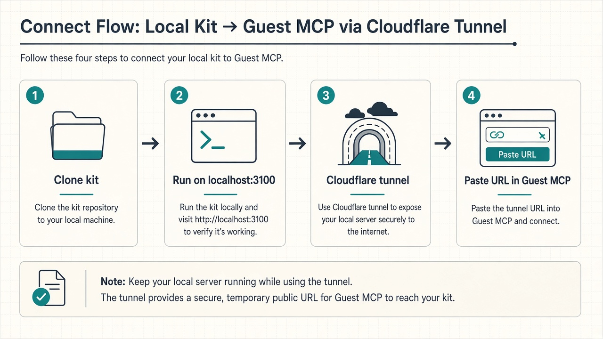
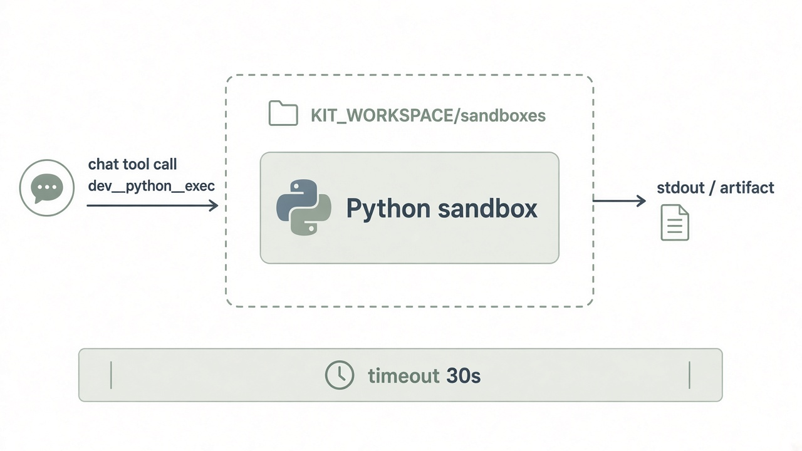

# aichallenge-mcp-kit

**Hierarchical MCP hub for your machine.** One Streamable HTTP `/mcp` + Bearer token. Attach child MCPs (filesystem, git, montage, …), run **sandboxed Python**, move files via **`/artifacts`**, then paste the tunnel URL into [AIChallenge](https://github.com/ArtemKyslicyn/AIChallenge) → **Свой MCP**.

AIChallenge never runs these processes. This kit never talks to the site database. The site only sees **one URL + one token**.



## Why a separate public repo?

| | |
|---|---|
| Site | Guest MCP client (SSRF-safe, chat tools) |
| This kit | Your PC: hierarchy, sandbox, big files |

Stdio MCP servers cannot be reached from a cloud chat. The kit publishes them behind one HTTPS tunnel.

## 5-minute connect



```bash
git clone https://github.com/ArtemKyslicyn/aichallenge-mcp-kit.git
cd aichallenge-mcp-kit
cp .env.example .env          # set KIT_SHARED_TOKEN (long random string)
cp kit.example.yaml kit.yaml  # enable the children you want
uv sync
uv run aichallenge-mcp-kit    # listens on 127.0.0.1:3100
```

In another terminal:

```bash
cloudflared tunnel --url http://127.0.0.1:3100
```

On the site (logged in): **Свой MCP** / Настройки → Подключения:

- **URL:** `https://<tunnel-host>/mcp`
- **Token:** same value as `KIT_SHARED_TOKEN`

Optional pack: [`packs/aichallenge-guest.example.json`](packs/aichallenge-guest.example.json) (replace the URL; never put the token in a shared pack file).

Full walkthrough: [docs/connect-aichallenge.md](docs/connect-aichallenge.md).

## What you get

- **Hierarchy:** `kit.yaml` → groups → children. Tool names: `{group}__{child}__{tool}` (e.g. `dev__python__exec`).
- **Hub tools:** `hub_list_children`, `hub_workspace_list|put|get`.
- **Python sandbox:** `dev__python__*` — cwd under `workspace/sandboxes/`, network off by default.
- **Stdio / HTTP proxy:** enabled children stay connected for the life of the process; tools are forwarded with prefixes.
- **Artifacts:** large outputs via `GET /artifacts/{id}` with the same Bearer.



## Docs

| Doc | Topic |
|---|---|
| [docs/architecture.md](docs/architecture.md) | Hub, groups, naming |
| [docs/connect-aichallenge.md](docs/connect-aichallenge.md) | Tunnel + Guest MCP |
| [docs/python-sandbox.md](docs/python-sandbox.md) | Exec limits |
| [docs/children.md](docs/children.md) | Adding stdio/HTTP children |
| [docs/security.md](docs/security.md) | Tokens, sandbox, risks |

Design origin (AIChallenge monorepo): `docs/superpowers/specs/2026-09-28-mcp-kit-hub-design.md`.

## Requirements

- Python 3.12+
- [uv](https://docs.astral.sh/uv/) recommended
- [cloudflared](https://developers.cloudflare.com/cloudflare-one/connections/connect-apps/install-and-setup/installation/) (or ngrok) for a public HTTPS URL
- Optional: Node/`npx` for official filesystem MCP; `uvx` for git MCP

## Security (read this)

Whoever has **URL + Bearer** can drive every enabled child and the Python sandbox on **your** machine (within workspace limits). Bind stays on loopback; only the tunnel is public. See [docs/security.md](docs/security.md).

## License

MIT — see [LICENSE](LICENSE).
