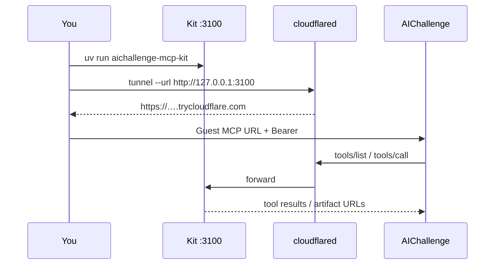

# Connect to AIChallenge


AIChallenge **Guest MCP** expects Streamable HTTP JSON-RPC at a URL ending in `/mcp`, with `Authorization: Bearer <token>`.

## Steps



1. Start the kit on loopback (`uv run aichallenge-mcp-kit` → `http://127.0.0.1:3100/mcp`).
2. Expose it with a tunnel:

   ```bash
   cloudflared tunnel --url http://127.0.0.1:3100
   ```

   Or ngrok: `ngrok http 3100` — use the HTTPS origin + `/mcp`.

3. Log in on the site → composer **Свой MCP** or Настройки → Подключения.
4. Paste:
   - URL: `https://<your-tunnel>/mcp`
   - Token: value of `KIT_SHARED_TOKEN` from kit `.env`
5. Enable the connection for the chat session.

## JSON pack

[`packs/aichallenge-guest.example.json`](../packs/aichallenge-guest.example.json) can prefill **name** + **url**. Put the token only in the site form — never commit a pack that contains a real Bearer.

## What the site must not do

- It must **not** call stand `/mcp/invoke` for your kit.
- It must **not** store your kit token in analytics or transcripts.
- Loopback URLs work only if the API has `GUEST_MCP_ALLOW_LOOPBACK=true` (local API). Production needs a real HTTPS tunnel host.

## Verify without the site

```bash
export TOKEN=…   # same as KIT_SHARED_TOKEN
curl -sS -H "Authorization: Bearer $TOKEN" http://127.0.0.1:3100/health
# Expect: {"ok":true,"service":"aichallenge-mcp-kit"}
```
