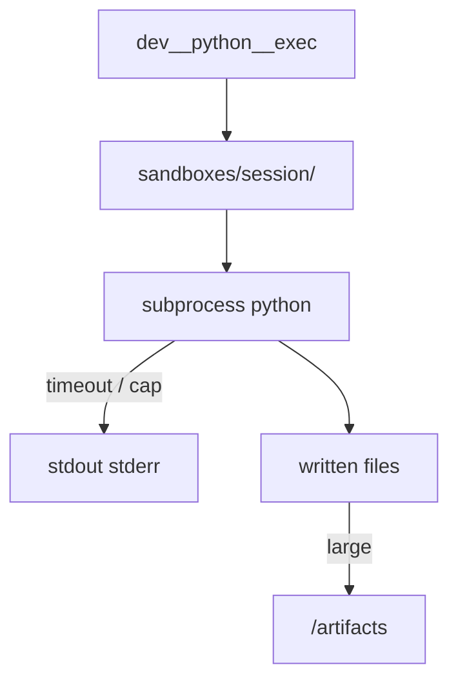

# Python sandbox

Builtin child under group **`dev`**, id **`python`** (`transport: builtin`, `module: python_sandbox`).

## Tools

| Prefixed name | Action |
|---|---|
| `dev__python__write` | Write a relative path under the sandbox session dir |
| `dev__python__exec` | Run `python` on a file or `-c` snippet |
| `dev__python__read` | Read a file or last stdout/stderr capture |
| `dev__python__reset` | Delete the session directory |

Session directory: `workspace/sandboxes/{session_id}/` (default session `default`).

## Limits (v1)

| Control | Default |
|---|---|
| Network | **Off** (`SANDBOX_NETWORK=false`) |
| Timeout | 30 seconds (`SANDBOX_TIMEOUT_SEC`) |
| Max stdout/stderr | 1 MiB combined |
| `pip install` from chat | **Not allowed** |
| Packages | Optional `sandbox_requirements.txt` for a pre-built venv |

Isolation v1 = subprocess with cwd pinned + env scrubbed (kit `*_TOKEN` / `*_KEY` stripped). Stronger isolation (Docker / bubblewrap) can be added later via env flags.

## Artifacts from Python

If a script writes a binary under the sandbox or `workspace/out/`, use `hub_workspace_get(..., as_artifact=true)` or `POST /artifacts` then `PUT` the bytes.

## Forbidden

- Reading the kit `.env` or paths outside `KIT_WORKSPACE`
- Spawning an unrestricted shell from python tools
- Enabling network without understanding the risk
